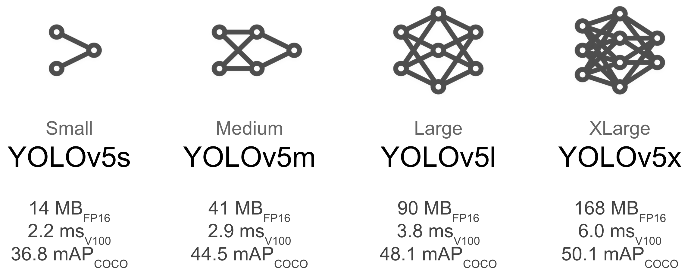

# Обучение модели

## Ultralytics
В качестве целевого решения задачи проекта была выбрана модель YOLOv5 и ее реализация из репозитория ultralytics (https://github.com/ultralytics/yolov5). Для того чтобы пользоваться данным фреймворком необходимо проделать следующие шаги
1. Создаем директорию нашего проекта (например, в консоли прописываем **'mkdir Traffic_lights'**
1. Переходим в созданную директорию и прописываем команду для скачивания репозитория: **git clone https://github.com/ultralytics/yolov5**
1. После окончания загрузки у нас появляется папка yolov5. Далее возможны следующие варианты:
 - Если вы используете локальную машину, то рекомендуется создать виртуальное окружение Python c помощью команды: **python -m venv path/to/virtualenv/** (для этого нужна библиотека virtualenv). Далее в командной строке прописываем **pip install -r requirements.txt** и накатяться необходимые библиотеки для проекта. 
 - Если вы используете docker container, то можете просто выполнить команду **pip install -r requirements.txt** в директории yolov5
 - Если же вы планируете обучать и прогнозировать в google colab, то для этих целей используется train.ipynb файл, в котором вы вначале прописываете команду **pip install -r requirements.txt** и далее реализуется процесс обучения и прогноза.
 
После этих шагов технические вопросы решены и нужно переходить к этапу подготовки данных для обучения.

## Данные 

Для решения поставленной задачи детекции светофоров были использованы следующие датасеты: LISA Traffic Light Dataset (https://www.kaggle.com/mbornoe/lisa-traffic-light-dataset), Bosch Small Traffic Lights Dataset (https://hci.iwr.uni-heidelberg.de/content/bosch-small-traffic-lights-dataset) и часть датасета COCO, содержащая картинки со светофорами. 

Всего в данных для обучения и валидации модели учавствовало 23397 картинок: 
- train часть - 19397
- val часть - 4060 

Так как итоговой архитектурой стала YOLOv5 и использовалась ее реализация из репозитория ultralytics (https://github.com/ultralytics/yolov5), то необходимо было проделать следующую подготовительную процедуру:
1. В директории с проектом (Traffic_lights) создаем папку для данных Data
1. В Data создать две директории train и val 
1. В этих директориях создать две поддиректории images и labels. В images нужно будет перенести картинки (img.png), а в labels соответствующий ему файл с разметкой (img.txt название такое же) в специальном формате. Формат разметки следующий: 
 - Каждому светофору на картинке соответствует одна строка: $class, x_{scaled}, y_{scaled}, width, height$
 - class - метка класса (в нашем случае 0 - зеленый, 1 - желтый, 2 - красный)
 - $x_{scaled}, y_{scaled}$ - отнормированные координаты центра bounding box'а на длину и ширину изображения ($x_{scaled} = \frac{x}{image\_width}$, $y_{scaled} = \frac{y}{image\_height}$
 - width, height - отнормированная ширина и высота bounding box'а ($width = \frac{width\_box}{image\_width}$, $heigth = \frac{heigth\_box}{image\_height}$)
 
Для каждого источника данных был реализован свой код перевода данных в нужный формат, так как разметка и сама схема хранения данных отличается у источников

#### LISA 
Переходим в папку проекта и в папку проекта скачиваем датасет по ссылке: https://www.kaggle.com/mbornoe/lisa-traffic-light-dataset. После подготавливаем и сохраняем данные опираясь на YOLO_data.ipynb 
#### BSTL
Переходим в папку проекта и в папку проекта скачиваем датасет. Инструкцию по скачиванию можно найти по ссылке: https://hci.iwr.uni-heidelberg.de/content/bosch-small-traffic-lights-dataset
#### COCO 
Так как в данных COCO есть светофоры, но нет их цвета была проведена процедура ручной разметки светофоров. Их общее количество около 500 картинок и загружены в train часть.

## Train 
Как было сказано ранее, мы в качестве целевой архитектуру выбрали YOLOv5. Одним из основных достойнств данной модели стала ее скорость и более высокое качестве (в терминах mAP) относительно ее предыдщуих версий (v2,v3,v4). Для решение нашей задачи по детекции светофоров, мы брали несколько вариантов предобученных моделей на датасете COCO, а именно small, medium, large:

После тестирования всех трех предобученных моделей было выявлено, что лучшее качество как и ожидалось дает YOLOv5 large и она укладывается в лимиты по времени при прогнозировании видео ряда. 

Для обучения модели использовался файл train.py из репозитория ultralytics и предварительно был создан файл DATA.yaml, в котором указано следующее: пути к train path, val path, количество классов и наименование классов. В консоли google colab мы прописываем следующую команду: **!python train.py --img 640 --batch 16 --epochs 5 --data DATA.yaml --weights yolov5l.pt**, где 
- --img 640 - разрешение картинки к которому мы приводим наши данные, 
- --batch 16 - размер батча,
- --epochs 5 - количество epoch для дообучения,
- --data DATA.yaml - описасние путей и классов,
- --weigths yolov5l.pt - веса предобученной модели

После обучения веса сохраняются по следующему пути /yolov5/runs/train/

# Предсказание и постобработка

## Предшествующие эксперименты и результаты

Первой архитектурой, выбранной для предсказания, была FasterRCNN. Обученные версии этой модели классифицировали и bounding box'ы, и сигнал светофора. Но при этом дополнительно разрабатывался алгоритм определения цвета с помощью opencv. Тестировались несколько вариантов алгоритмов определения цвета.
1. Нахождение с помощью перевода в hsv наиболее ярких областей, отделение сигнала светофора от остальной картинки и определение цвета в выделенной области сигнала.
2. Определение цвета сигнала по положению огонька в светофоре.

Данные алгоритмы давали тосность не выше 0.8, так как результаты сильно зависят от формы bounding box'ов. Если box'ы значительно больше реальных границ и фон за светофором нетемный или очень яркий, то цвет в большинстве случаев определялся неверно. Для светофоров в желтом корпусе требовались отдельные версии алгоритмов, так как они слишком светлые, что искажало результаты определения цвета. Также из-за особенностей камеры, с которой было взято изображение, цыета искажались и красные светофоры часто почти в половине случаев определялись как желтые. Данные алгоритмы потенциально можно использовать, однако они требуют доработки и возможность калибровки цветов для конкретной камеры.
FasterRCNN оказалась слишком медленной, поэтому принято решение поменять ее на YOLOv5.
YOLOv5 можно использовать двумя способами: через консольные запуск, через подгрузку модели через torch.hub.load.
При консольном запуске на вход модели подается путь к видео, а результаты предсказания выдаются в виде набора txt файлов с именем вида "videoname_frameid". Поэтому появилась задача создания функции, которая считывала бы все выходные txt файлы и записывала результаты в один json файл в требуемом формате. Так как результаты детекции YOLO записываются в формате нормированных по ширине и высоте кадра значениях [x_center, y_center, width, height], то был добавлен также перевод этих значений в требуемые координаты верхнего левого угла и правого нижнего угла bounding box'а.
От данного формата запуска модели в итоге мы отказались, так как это требует дополнительного клонирования репозитория ultralytics, что избыточно для задачи предсказания. Поэтому используется способ с подгрузкой модели через torch.hub.load. В таком варианте модель выдает координаты bounding box'ов в нужном формате, классы светофоров и значение confidence. Кроме того, такой вариант позволяет использовать модель внутри функции и контролировать кадры, подающиеся ей на вход.
При разработке функции check_similarity() сразу была выбрана используемая метрика, тестировались только пороговые значения. Оптимальным в ходе экспериментов оказалось значение 0.02.
Для функции affect были протестированы 3 алгоритма.
1. Выбор самого центрального светофора. Данный алгоритм часто выдавал неверные результаты, так как самым центральным мог оказаться дальний светофор, не влияющий в действительности на движение машины в данный момент.
2. Добавление отбора только больших светофоров. Данная модификация значительно улучшила результаты, в ходе экспериментов был выбран порог 4: светофоры, площадь которых меньше самого большого светофора минимум в 4 раза, отсеиваются.
3. Учет высоты светофора на кадре. Данный модификация также улучшила результаты. Дальние светофоры всегда ниже ближайших, поэтому, даже если их площадь оказалась достаточно большой, они отсеятся, как неподходящие.

Функция interpolation также имела несколько версий.
1) Пересчет координат между ключевыми кадрами, удаление детекций, если они для меньше опредленного количества кадров, заполнение пропущенныхкадров, если в последующих кадрах продолжается детекция этого светофора. Однако эта версия для пересчета текущих координат использует информацию о последующих кадрах, что противоречит задаче.
2) Пересчет координат на основе среднего изменения предыдущих 30 кадров. Такой способ также помогает сгладить результаты детекции и снизить "дрожание" светофоров.
3) Добавление условий для определения влияния светофоров. Теперь после короткого определения affect True и после долгого определения такого статуса для одного светофора делается пауза в определении влияния и в течение определенного количества кадров все светофоры становятся affect False, что заметно снижает количество False Positive результатов.
Все проделанные эксперименты позволили значительно углабить знания в области обработки изображений и компьютерного зрения в частности.

## Описание процесса предсказания

Предсказание светофоров на видео существляется с помощью основной функции video_predict из модуля predict.py и связанных с ней функций, осуществляющих постобработку результатов детекции нейросетью YOLOv5l.

С помощью библиотеки opencv видео покадрово считывается и передается в нейросеть. На выходе получаем массив с координатами ограничивающих прямоугольников, значением confidence (коэффициент "уверенности" нейросети в предсказаниях) и классом, которые означает сигнал светофора.

Предсказанные нейросетью ограничивающие прямоугольники и сигналы светофоров записываются в словарь, где ключ - номер кадра, значение - словарь обнаруженных светофоров с уникальным id, координатами верхнего левого и правого нижнего углов bounding box'ов и состояния светофров. В этот словарь не попадают детектированные объекты, для которых значение confidence нейросети мало.

Составленный для всех кадров словарь передается на постобработку результатов с помощью функции interpolate() из модуля predict.py. данная функция производит "сглаживание" траектории движения светофора на видео и изменения размера его bounding box'а. 

После преобразования координат для каждого кадра определяется светофор, который влияет на движение машины. Такому светофору ставится значение True для ключа "affect", если светофор не влияет, то записывается False.

Итоговые результаты детекции записываются в .json файл с заданным пользователем названием.

## Алгоритмы используемых функций

### video_predict()

Функция покадрово считывает видео и для каждого кадра определяет bounding box'ы, сигналы светофоров и их влияние на полосу.
Для ускорения предсказания в нейросеть подается только каждый второй кадр, для пропущенного кадра копируются результаты предыдущей детекции. Также для последующих кадров вычисляется коэффициент похожести изображений в области предсказанных ранее ограничивающих прямоугольников. Если новый кадр определяется, как похожий с последним переданным в нейросеть кадром (значение метрики меньше 0.02), то для данного кадра копируются предыдущие результаты детекции. Опеределение схожести изображений осуществляется функцией check_similarity() из модуля predict.py
Полученные результаты передаются в функцию interpolation(), а затем записываются в указанный пользователем файл.
**Статистика предсказаний для видеокарты Tesla P100-PCIE-16GB**
| Видео       |Длительность видео мин:сек  | Время предсказания |
| ------------|:------------------:| -----:|
| Video_0     | 00:40 | 00:14 |
| Video_1     | 00:40 | 00:24 |
| Video_2     | 00:40 | 00:11 |
| Video_3     | 02:10 | 02:15 |
| Video_4     | 00:35 | 00:47 |
| Video_5     | 00:40 | 00:27 |

### check_similarity()

Данная функция вычисляет метрику похожести изображений в области bounding box'ов.
Полученные на вход 2 изображения переводятся в одноканальный (черно-белый) формат.
Для каждой области bounding box'а целые значения цвета переводятся в область значений [0,1]. После этого вычисляется разность изображений и находится среднее значение этой разности, которая и является знаечнием метрики. Данная метрика соответствует первой норме.
Если для каждого box'а значение полученной метрики меньше 0.02, то изменения в текущем изображении считаются незначительными и возвращается знаечние True (изображения практически одинаковые). В таком случае для текущего изображения копируется предыдущее предсказание. Если же хотя бы для одного box'а значение метрики больше или равно 0.02, то возвращается False (ищображения различаются) и для данного кадра box'ы предсказываются нейросетью.

### interpolation()

На вход этой функции подается словарь с полученными для каждого кадра предсказаниями, который используется для отслеживания светофоров на видео.
dict_key_points хранит данные о первой и последней детекции каждого светофора под уникальным ключом.
dict_j хранит ключ отслеженного светофора в полученном на входе словаре для каждого кадра по порядку.
После заполнения словаря отслеживание для каждого свеофора вычисляются новые кооординаты на основе предыдущих координат этого светофора. Новые координаты вычисляются путем усреднения изменения координат на предыдущих 30 (максимум) кадрах. Новые координаты определяются относительно i-30 кадра, где i номер текущего кадра.
После вычисления новых координат для каждого кадра вычисляется влияющий светофор с помощью функции affect.
Чтобы снизить количество появления ложноположительных влияний устанавливается пауза в 30 кадров. Это значит, что при смене цвета влияющего светофора на i-ом кадре, на текущем кадре и всех кадрах до i+30 все светофоры будут признаны affect False. Если предыдущий цвет светофора являлся affect True дольше 30 кадров, то пауза устанавливается в 15 кадров, так как в таком случае смена цвета может означать верное определение affect, в таком случае пауза в 15 кадров не повлияет на результаты метрики, определяющей верность окончательных предсказаний. Если смена цвета произошла на том же светофоре, то пауза не устанавливается и обновляются переменные отслеживания.

### affect()

Данная функция принимает на вход box'ы и ширину кадра.
Вычисляется площадь каждого светофора и отсеиваются те светофоры, площадь которых меньше максимальной площади минимум в 4 раза. Это позволяет отсеить далекие светофоры. которые точно не влияют на движение в текущий момент. Таким светофорам автоматически присваивается расстояние до середины (учитывается только ширина) кадра 2000.
Для оставшихся светофоров расстояние кадра равно истинному растоянию до середины. Данный критерий был выбран, так как на большинстве тестируемых видео влияющий светофор оказывался ближе всего к центру.
Из светофоров выбираются два ближайших к центру.Пусть первый светофор ближе к центру. Если первый светофор оказывается ниже второго и при этом расстояние между ними достаточно мало, то влияющим светофором выбирается второй. Если хотя бы одно из условий не выполнется, то влияющим выбирается первый. Такой дополнительный критерий позовляет выбрать действительно влияющий светофор в случае, если для дальнего светофора предсказывается bounding box значительно больше его размера.
Функция возвращает список значений True и False соответственно исходному порядку светофоров. affect True всегда может быть не более олного светофора.

# Воспроизведение видео с предсказанными box'ами

Воспроизведение видео происходит с помощью функции video_display() из модуля predict.py. Эта функции принимает в качестве параметров путь к исходному видео, путь к видео с box'ами, путь к json файлу с предсказаниями.
Функция покадрово считывает исходное видео, отрисовывает на нем получившиеся ограничивающие прямоугольники цвета сигнала свеофора и подписывает влияющий светофор с помощью надписи affect под этим светофором. Получившийся кадр добавляется к выходному видео.
После результатов на всех кадрах, получившиеся картинки собираются в выходное видео, заданного формата и с частотой кадров, котоая равна частоте кадров исходного видео.

# Итоги
Полученная нейросеть и допонительный функции позволяют достаточно хорошо произвести детекцию светофоров, определить их сигнал и влияние на движение машины. Безусловно, полученные результаты неидеальны. Для лучшей работы нейросети требуется больше данных, особенно для редких видов светофоров и для желтого сигнала свеофора, так как таких примеров оказалось мало даже с применением аугментаций. Алгоритмы постобработки результатов также можно значительно улучшить, если провести анализ на выявление более сложных закономерностей и установление оптимальных гиперпараметров.
Полученные результаты и алгоритмы достаточно хорошо выполняют поставленную задачу и могут являться основой для разработки более сложных систем.
